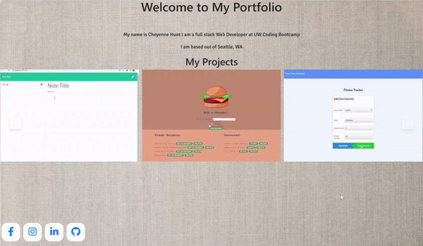

# Web Development Portfolio

## Table of contents

- [General info](#general-info)
- [Technologies](#Technologies)
- [Summary](#Summary)
- [Author](#Author)
- [License](#License)

## General info

My Web Development Portfolio

This project utilizesgit HTML, CSS, JavaScript, and ES6. 

- React
- Node.js

## Technologies

Project is created with:

- [React](https://reactjs.org/)
- [JavaScript](https://www.javascript.com/)
- [Bootstrap](https://getbootstrap.com/)
- [Node.js](https://nodejs.org/)
- [Glide.js](https://glidejs.com/)

## Summary

- This is my project portfolio with a built in carousel to display my projects I've built displaying some of my heroku projects. 

## Author

- Cheyenne Hunt 

## License

- Open Source
